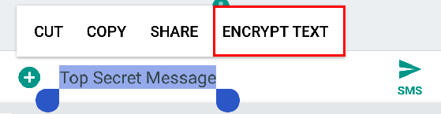
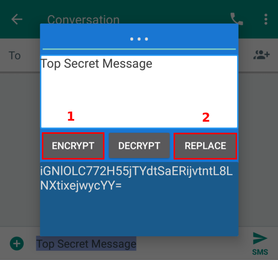
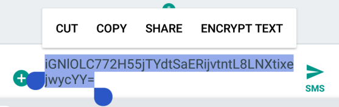

# EncryptText App for Android
A simple application to encrypt text. Can be used in combination with many other applications, to increase security and privacy.

# Usage
The application can be opened just as any other application. However, to avoid
the tedious application switching, the encryption can happen in-place, in any 
application.

First, select the text you want to encrypt:

Enter the password at the top ( *optional, but recommended* ), and hit 
**ENCRYPT**:

The encrypted message will appear at the bottom. Click **REPLACE** to close the
application and replace the original text:

# Installation

